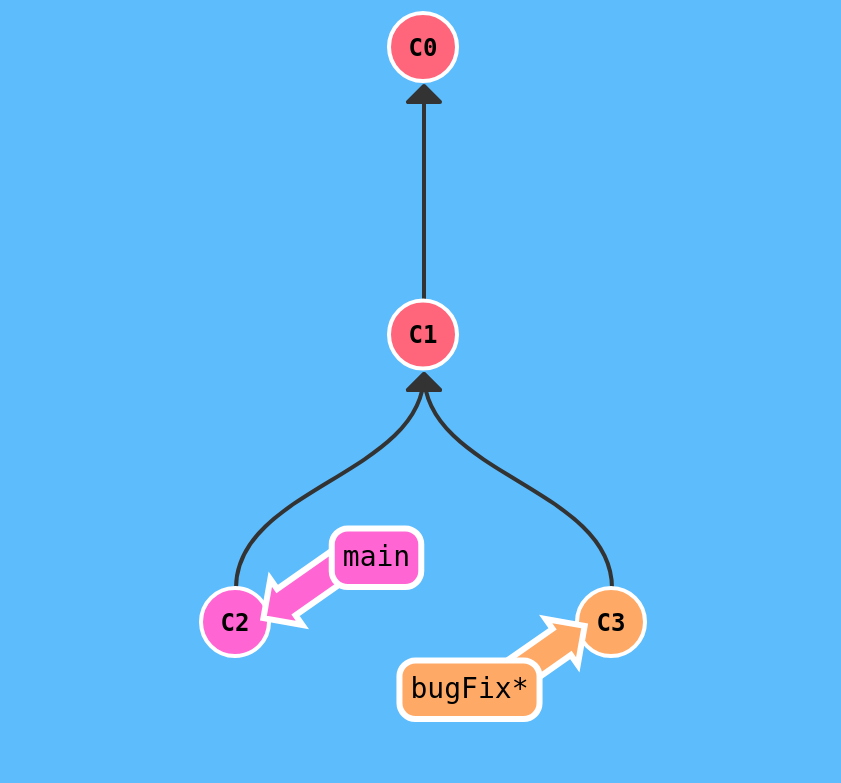
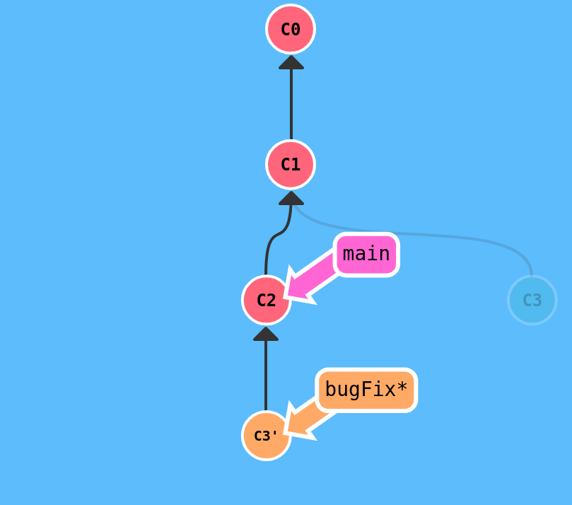
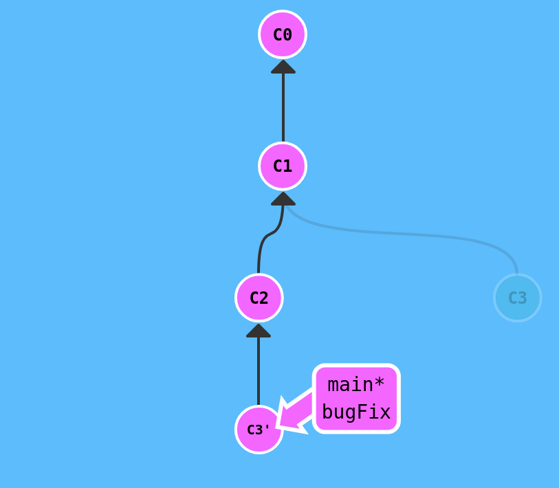

# Basic Git Commands

## Git Commit

A commit in a git repository records a snapshot of all the (tracked) files in your directory. It's like a giant copy and paste, but even better!
Git wants to keep commits as lightweight as possible though, so it doesn't just blindly copy the entire directory every time you commit. It can (when possible) compress a commit as a set of changes, or a "delta", from one version of the repository to the next.
Git also maintains a history of which commits were made when. That's why most commits have ancestor commits above them -- we designate this with arrows in our visualization. Maintaining history is great for everyone working on the project!
It's a lot to take in, but for now you can think of commits as snapshots of the project. Commits are very lightweight and switching between them is wicked fast!

**Example:**
```
git commit -m "Add Git commit basic usage"
```

or 
```
git commit -m "Add Git commit basic usage" -m "Includes examples of how to create commits with -m flag and multi-line commit messages."
```

## Git Branches

Branches in Git are incredibly lightweight as well. They are simply pointers to a specific commit -- nothing more. This is why many Git enthusiasts chant the mantra:
branch early, and branch often
Because there is no storage / memory overhead with making many branches, it's easier to logically divide up your work than have big beefy branches.
When we start mixing branches and commits, we will see how these two features combine. For now though, just remember that a branch essentially says "I want to include the work of this commit and all parent commits."

**Branching Steps:**
```
git branch yourBranchName  #create branch
git checkout yourBranchName  #change control to branch
git add .
git commit -m "Your commit message"
```

**Shortcut (create + switch in one step)**
```
git checkout -b yourBranchName
```

## Branches and Merging

Great! We now know how to commit and branch. Now we need to learn some kind of way of combining the work from two different branches together. This will allow us to branch off, develop a new feature, and then combine it back in.
The first method to combine work that we will examine is git merge. Merging in Git creates a special commit that has two unique parents. A commit with two parents essentially means "I want to include all the work from this parent over here and this one over here, and the set of all their parents."
It's easier with visuals, let's check it out in the next view.

**Command:**
```bash
git merge bugFix
```


First of all, main now points to a commit that has two parents. If you follow the arrows up the commit tree from main, you will hit every commit along the way to the root. This means that main contains all the work in the repository now.

## Git Rebase

The second way of combining work between branches is rebasing. Rebasing essentially takes a set of commits, "copies" them, and plops them down somewhere else.

While this sounds confusing, the advantage of rebasing is that it can be used to make a nice linear sequence of commits. The commit log / history of the repository will be a lot cleaner if only rebasing is allowed.

Let's see it in action...

Here we have two branches yet again; note that the bugFix branch is currently selected (note the asterisk)

We would like to move our work from bugFix directly onto the work from main. That way it would look like these two features were developed sequentially, when in reality they were developed in parallel.

Let's do that with the git rebase command.

```bash
git rebase main
```



Awesome! Now the work from our bugFix branch is stacked "on top of main", since it points to main. In our visualization though, its shown below main since our commit trees flow downwards.

Note that the commit C3 still exists somewhere (it has a faded appearance in the tree), and C3' is the "copy" that we rebased onto main.

The only problem is that main hasn't been updated either, let's do that now...



then you do

```bash
git checkout main
git rebase bugFix
```

Since main was an ancestor of bugFix, git simply moved the main branch reference forward in history.




# Writing Good Git Commit Messages

Good commit messages matter.
They make it easier to understand **why** changes were made, simplify debugging, and help future maintainers (including you). A `git diff` shows *what* changed, but the commit message explains *why*.

Bad logs are confusing. Good logs save time and improve collaboration.

---

## The 7 Rules of a Great Commit Message

1. **Separate subject from body with a blank line**

   * Subject: short summary.
   * Body: optional, for context.
   * Example:

     ```
     Fix typo in user guide

     Corrected spelling of "configuration" in introduction.
     ```

2. **Limit subject line to \~50 characters**

   * Keeps it readable and consistent.
   * If it’s too long, you might be committing too much at once.

3. **Capitalize the subject line**

   * ✅ `Add login validation`
   * ❌ `add login validation`

4. **Do not end subject with a period**

   * ✅ `Fix broken test case`
   * ❌ `Fix broken test case.`

5. **Use imperative mood** (like giving a command)

   * ✅ `Add error handling for null values`
   * ❌ `Added error handling for null values`
   * Think: *“If applied, this commit will…”*

6. **Wrap the body at 72 characters**

   * Makes it easy to read in terminals and tools.

7. **Use the body to explain *what* and *why*, not *how***

   * Code shows *how*. Message explains the reason.
   * Example:

     ```
     Simplify user session handling

     Replaced manual token cleanup with a scheduled task. 
     This prevents memory leaks and makes sessions easier to manage.
     ```

---

## Example of a Proper Commit

```
Add validation to signup form

Ensure that emails follow the correct format and passwords 
are at least 8 characters long. This prevents invalid data 
from being stored and improves user experience.

Resolves: #42
```

---

## Practical Tips

* **Atomic commits**: Commit one logical change at a time.
* **Small, frequent commits**: Easier to review and rollback.
* **Use the command line**: More control, less clutter.
* **Reference issues/PRs**: Helps track changes.

---

👉 **Bottom line:** Good commit messages = better collaboration, faster debugging, and cleaner history.


